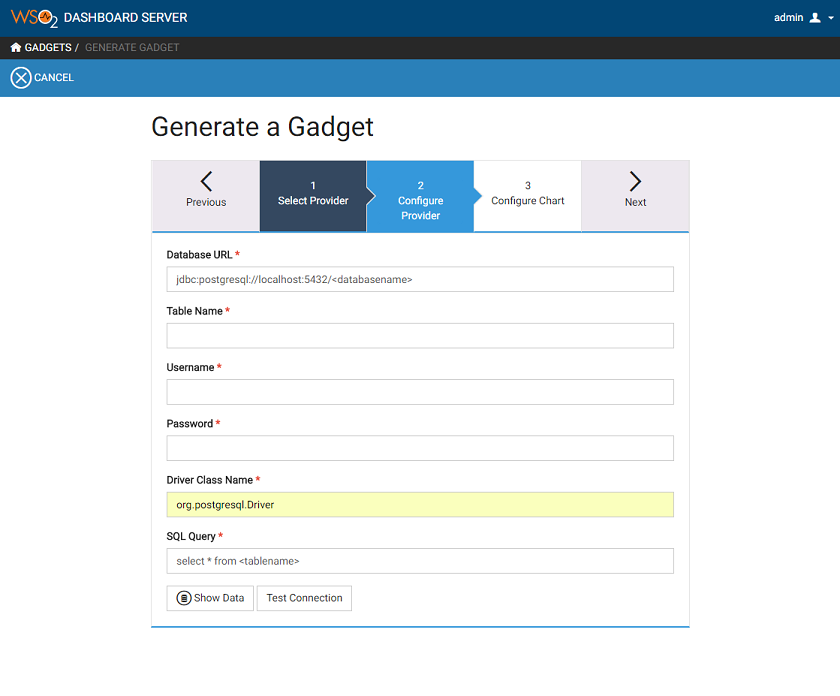
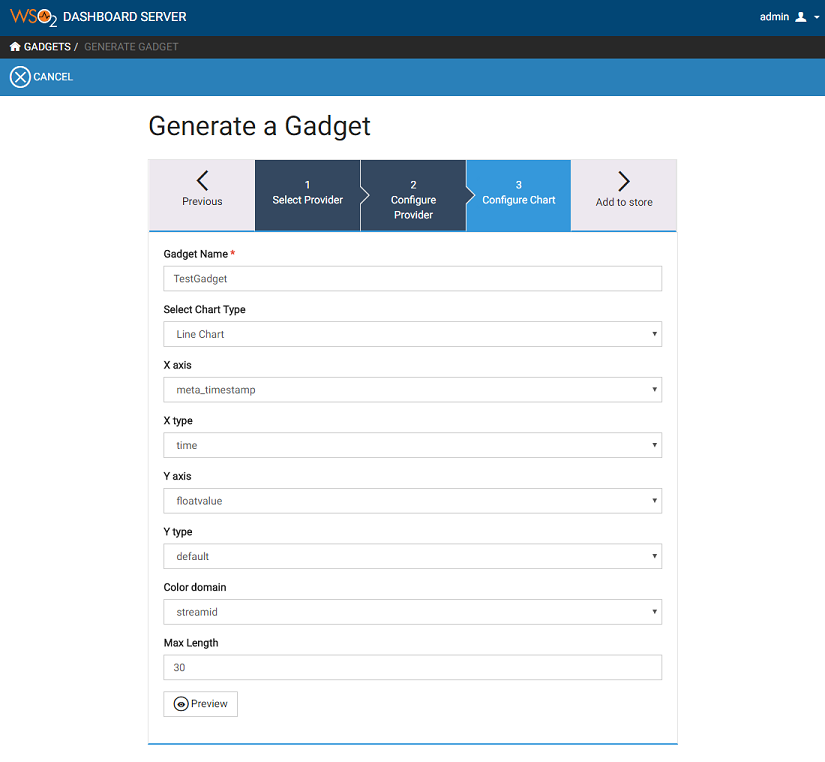
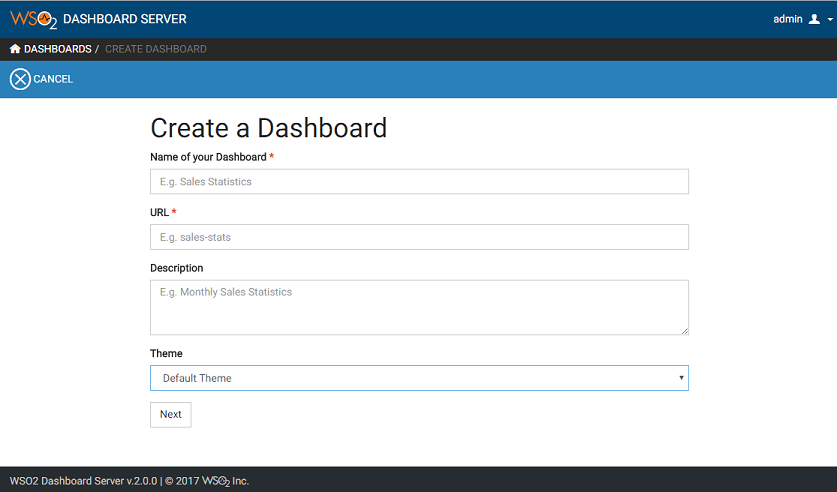
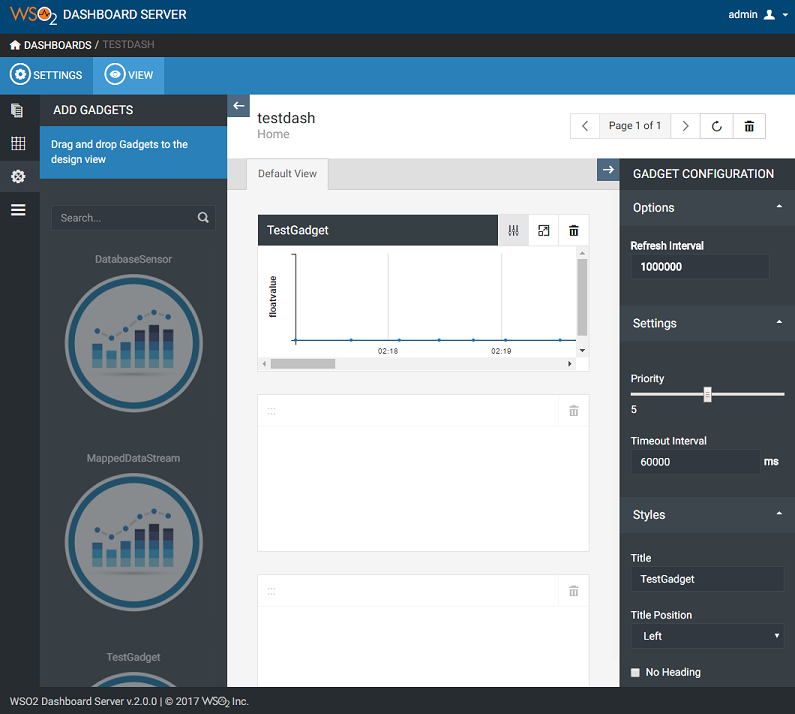

# Using the WSO2 Dashboard

>  
__Note:__ If you are using the Wso2 Dashboard v2.0 you will need to modify the source code before you can use the dashboard.  
Follow this steps:  
1. Navigate to this directory: < WSO2 DAS Home >/repository/deployment/server/jaggeryapps/portal/extensions/providers/rdbms  
2. Open the Api.js in an editor of your choice.  
go to line (line numbers can change in every version, look good at the pictures to add the changes):  
48 → add an data type specific for PostgreSQL.  
  
The following changes are in one specific function that starts on line 90.
  
99 → Change the 'column_type' to 'data_type'.  
107 → Change in the query the "column_type" to "data_type".  
On the same line you need to delete a part from the query →   databaseName + "' and table_name='" +  
On the next line:
108 → you need to add this " ,{driverClassName : providerConfig['driver_class_name']} " after "  providerConfig['password'] ".  
__Now you can save this file__  

3. The last changes need to made in another file in the same directory. 
Open the config.json file and add the following lines.
  
__Now safe the file and restart the WSO2 DAS server if this was running__
>  

## Opening the Dashboard
You can navigate to the Dashboard by clicking on "Analytic Dashboard" in the WSO2 DAS Management Console under Main → Dashboard tab or by navigating directly to https://<HOST_NAME>:<PORT>/portal/dashboard.
You will be redirected to a webpage that will look something like this:  

  
U can log in with the Username "admin" and the Password "admin".

Once you are logged in you can create a dashboard. But first you need to make a gadget that you can place on to the dashboard.

## Making a gadget  
You can create a gadget by opening the menu → Gadgets → Generate Gadgets. As shown below:  

  

Once you are on the Generate a gadget screen choose the type of data you want to use in this example we will use a Relational Database Source.  
Select "Relational Database Source" and go to the next slide.  

  

Fill in the data of your database address, Table name, Username, Password ,The driver of the database you use and the query you want to use. Once you filled in all the data you can test whether or not the connection is valid. If your connection is valid you can go to the next slide.  

  

On this slide you can configure the type of chart you want and witch data needs to be used. Colour domain defines by what data needs to be grouped. Once everything is filled in you can add the gadget to the store.

  

Once the gadget is added to the store you can start to make a dashboard by navigating to the portal and clicking on the "CREATE DASHBOARD" button. You will be guided to the following page. Here you can fill in a name and a description for your dashboard. Once you this is done go to the next page.

  

First you will need to select an layout for your dashboard.
Once your dashboard has a layout you can add your gadget that you have created. You will end up with something like this.  

  

When you placed all your gadgets on to the dashboard u can view your dashboard by pushing the view button. A new page will open with your dashboard.
