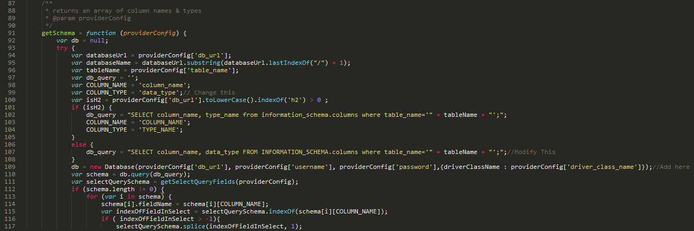

# Using the WSO2 Dashboard

>  
__Note:__ If you are using the Wso2 Dasboard v2.0 you will need to modify the source code before you can use the dashboard.  
Follow this steps:  
1. Navigate to this directory: < WSO2 DAS Home >/repository/deployment/server/jaggeryapps/portal/extensions/providers/rdbms  
2. Open the Api.js in an edditor of your choise.  
go to line (line numbers can change in every version, look good at the pictures to add the changes):  
48 → add an data type specific for postgresql.  
  
>
>  
The following changes are in one specific function that starts on line 90.
  
99 → Change the 'column_type' to 'data_type'.  
107 → Change in the query the "column_type" to "data_type".  
On the same line you need to delete a part from the query →   databaseName + "' and table_name='" +  
On the next line:
108 → you need to add this " ,{driverClassName : providerConfig['driver_class_name']} " after "  providerConfig['password'] ".  
__Now you can save this file__
>  

>  
The last changes need to made in another file in the same directory. 
Open the config.json file and add the following lines.
  
__Now safe the file and restart thes WSO2 DAS server if this was running__
>  

## Opening the Dashboard
You can navigate to the Dashboard by clicking on "Analytic Dashboard" in the WSO2 DAS Managment Console under Main → Dashboard tab or by navigating directly to https://<HOST_NAME>:<PORT>/portal/dashboard.
You will be redirected to a webpage that will look something like this:  

  
U can log in with the Username "admin" en the Password "admin".

Once you are logged in you can create a dashboard. But first you need to make a gadget that you can place on to the dashboard.

## Making a gadget  
You can create a gadget by opening the menu → Gadgets → Generate Gadgets. As shown below:  

[Creating a gadget](img/creatinggadget.gif)  

Once you are on the Generate a gadget screen you 