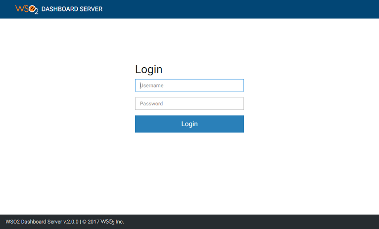

# Using the WSO2 Dashboard

### Content
## Opening the Dashboard
You can navigate to the Dashboard by clicking on "Analytic Dashboard" in the WSO2 DAS Managment Console under Main → Dashboard tab or by navigating directly to https://<HOST_NAME>:<PORT>/portal/dashboard.
You will be redirected to a webpage that will look something like this:  

  
U can log in with the Username "admin" en the Password "admin".

Once you are logged in you can create a dashboard. But first you need to make a gadget that you can place on to the dashboard.

## Making a gadget  
