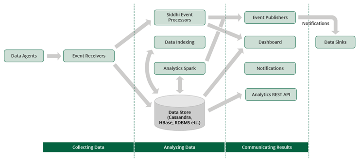
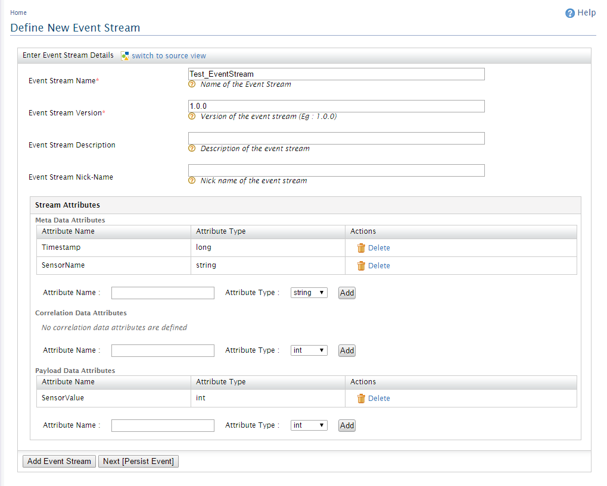
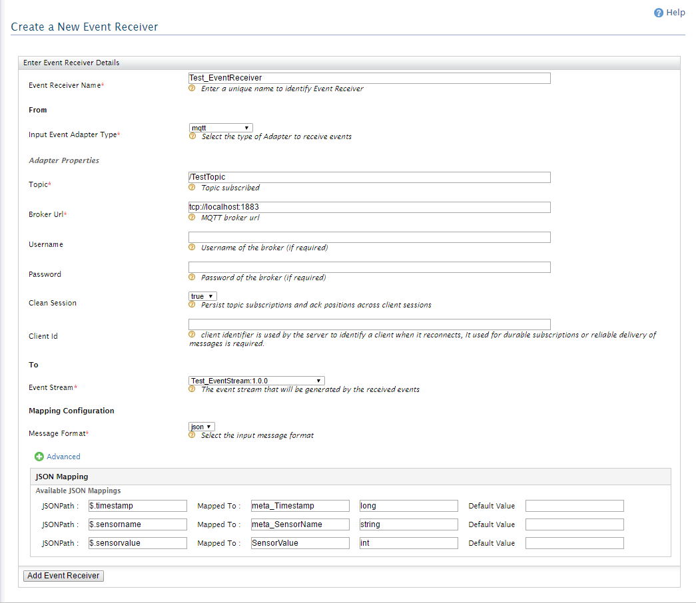
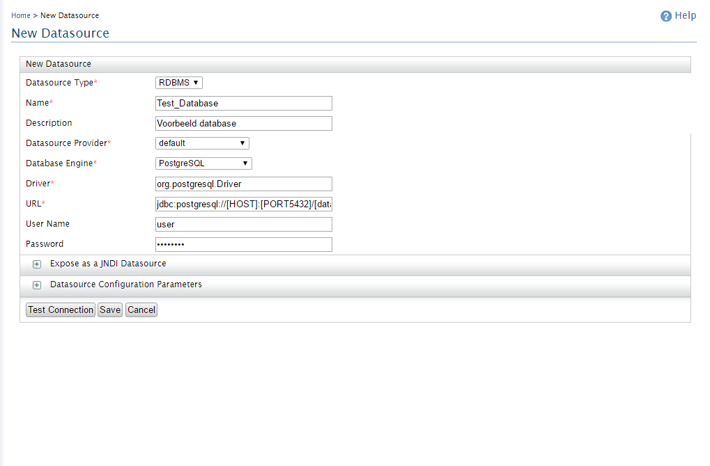
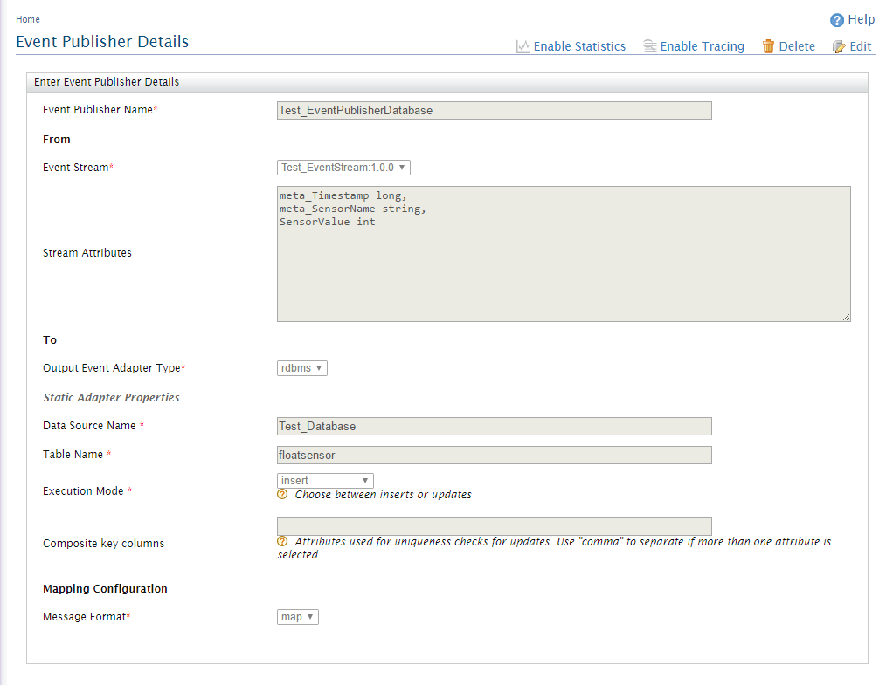

# Installing and working with the WSO2 DAS server

### Content  
* [Downloading the product](#download)
* [Setting up JAVA_HOME](#settingup)
* [Running the server](#running)
* [Accessing the Management Console](#accessing)
* [Wso2 DAS Architecture](#architecture)
* [Creating a flow](#flow)
* [References](#references)

<a name="download"/>
## Downloading product
1. [WSO2 Data Analytics Server Download page](http://wso2.com/smart-analytics#iBottom).
2. Unzip the file in the directory of your choice.

<a name="settingup"/>
## Setting up JAVA_HOME

Before you can use the server you need to add the JAVA_HOME variable to the environment variables. If you already have java 1.7 or 1.8 installed you can skip this part.

 * first you need to install java. the WSO2 DAS server only supports java 1.7 & 1.8
 * you can install the default java using the following line:  

 	```sudo apt-get install default-jdk```
 * once the default JDK is installed you can install the java version you want.
 I chose java 1.8  

 	```sudo apt-get install oracle-java8-installer```  

 * There can be multiple Java installations on one server. You can configure which version is the default for use in the command line by using update-alternatives, which manages which symbolic links are used for different commands.
 * This line will result in an table with all Java versions and there path. 

 	```sudo update-alternatives --config java```
 * now you need to set the JAVA_HOME variable using the following lines:

    ```
    export JAVA_HOME=/usr/lib/jvm/java-8-openjdk-amd64
    export PATH=${JAVA_HOME}/bin:${PATH}
    ```  

 * To verify that the variable is set correctly, execute the following command:  
 		
 	```echo $JAVA_HOME```

<a name="running"/>
## Running the server 

* To start the server you need to run the wso2server.sh document in the bin directory. ```<wso2_das_folder>/bin/```. you can run the server with this command once you are in the bin directory.

	```
	sh wso2ser.sh
	```

* To stop the server, press Ctrl+C in the commmandline or shut the server down in the Management Console.
* to run the server in the background, use the following code:
	```
	sh wso2server.sh start
	sh wso2server.sh stop
	```

<a name="accessing"/>
## Accessing the Management Console

* Once the server is started, u can access the management console by opening the URL that is given in the console. The URL will look like this:

	```https://<server host>:9443/carbon/```
    
    
* U can sing-in in the server using admin as both the username and password.

<a name="architecture"/>
## Wso2 DAS Architecture

the Wso2 DAS architecture is shown in the illustration below. We will explain some of the components.  
  
### Data Agents
Data agents are the external sources that publish data to the WSO2 DAS. 

### Event Receivers
The WSO2 DAS receives the data that is published by the data agents through Event Receivers. Every event receiver passes data to an dedicated event stream. This stream than analyses, processes and/or stores the data. After the data is processed the stream will push to an event publisher and or a dashboard.

### Data Storage
The WSO2 DAS supports different Data stores.
>  
__Note:__ Before you u can use a data storage, you need to make an Data source in the Management Console under Configure → Data sources.
>

### Event Publishers
Event publishers push the data to external sources. The event publishers support various protocols. 

### Analytics Dashboard
The Analytics Dashboard is used for visualising the data either from live data sources or from a data storage. Here you can create custom gadgets to make a custom dashboard.

<a name="flow"/>
## Creating a flow  
1. The first step is to create an event stream. To create an event stream, you need to go to the management console. In the Main tab go to Manage → Event → Streams. On this page you can see the existing event streams. Click on the Add Event Stream button. You will be redirected to the following page. Where you can define the Event Stream and add the Stream Attributes.

	  

	There are three kind of attributes:
	1. Meta Data 

		Meta data is used to describe the data

	2. Correlation Data  

		Correlation data can be used to search data that is linked together 

	3. Payload Data

		Payload data is the actual data that we will analyse and show on the dashboard.

>  
After entering the attribute data you can click the __Add__ button to add the attribute to the stream.  
>

<a name="steptwo"/>
2. The next step is to add an Event receiver so the WSO2 DAS can receive data to process. You can create an Event Receiver by going to the Main tab → Manage → Event → Receiver.  
	You well get to see the next screen:  
	  
	Here you can give the event receiver a name and what the input type is. In this case we want to receive MQTT packets from an MQTT broker that is running beside the WSO2 DAS. We can receive data from the WSO2 Message Broker on port 1883 (if there is no offset on the Message Broker). The topic is important for the message broker as it needs to know to whom which topics need to be send.  
  
>  
__Note:__After configuring the receiver it is important to define how data is mapped.
>  

Standard the receiver expect data to be mapped like the structure below:

```
{
	"event":
	{
		"metaData":
		{
			"timestamp" : 123456789123,
			"sensorId" : 1
		},
		"correlationData":
		{
			"cordinaatX" : 51,
			"cordinaatY" : 4
		}, 
		"payloadData" : 
		{
			"sensorValue" : 180
		}
	}
}
```  
In this case our data is going to look something like this:  
```
{
	"sensorname" : "FloatSenor",
	"timestamp" : 1234657891234,
	"color" : "yellow",
	"sensorvalue" : 180.456465
}
```  
The order of the variables is not important, the fact that not every variable in the data packet is used is also not important. The structure above can be mapped like in the picture in [step 2](#steptwo).

3.The last step is to complete our flow by adding an publisher that stores, sends or logs the data.
>  
__Note:__ Before you u can use a data storage, you need to make an Data source in the Management Console under Configure → Data sources.
>
  

You can add an event publisher under the Main tab → Manage → Event → Publishers.  
  

There are many different publisher types, in this example we will make a rdbms Event Publisher.


After creating the Event Publisher you can view the flow that we just completed under the Main tab → Manage → Event → Flow.

<a name="references"/>
### References
title: "WSO2 Data Analytics Server Documentation"  
link: [WSO2 Data Analytics Server Documentation](https://docs.wso2.com/display/DAS310/About+DAS)(accessed March 15, 2017)