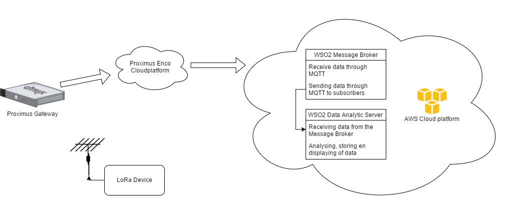
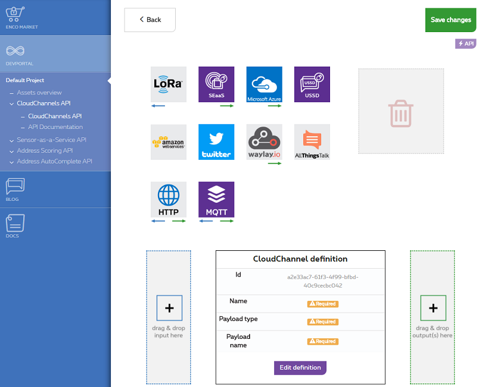
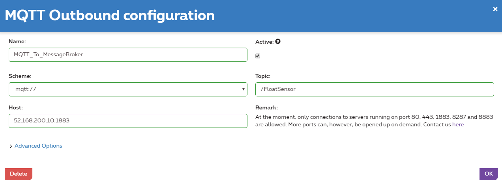

# Introduction

For this project, 2 [LORAWAN Rapid Development Kits](http://www.allthingstalk.com/lorawan-rapid-development-kit) are available from www.allthingstalk.com.  

These kits come with access to the following websites:  

* https://maker.allthingstalk.com  
* https://devs.enco.io/dashboard  
username = kristof.lievens@i8c.be  
password = L0Ra2017!  

## This Demo

This demo sends data trough the LoRa network to an WSO2 Message Broker that receives data from the Proximus Enco cloud platform through MQTT, the Message Broker will send the data to an through WSO2 Data Analytics Server that will analyse, store and display the data. As shown in the diagram bellow:  

  

The goal of this demo is to process data from a LoRa device that monitors temperature, humidity an pressure. Once the data is processed the data will be presented on an WSO2 Dashboard.

### Step 1  

As a first step, follow these tutorials to activate your device and to get up and running:

* This tutorial will help you to set up the software: [getting started from Sodaq](http://support.sodaq.com/mbili/)
* This tutorial will help you to register your device: [Enco](http://docs.enco.io/docs/getting-started-with-enco)
* [AllThingsTalk](http://docs.allthingstalk.com/tutorials/setup-lora-rapid-development-kit/) 

### Step 2

Once you activated your device you can download the code from the git folder. Once the code is downloaded you can upload it to the Sodaq Mbili board. By first connecting the board to the computer and then clicking the upload button in the upright corner.
All the necessary libraries are included in every code folder. This way changes can be easily made in the library's. The original library file can be find in the library folder in the code folder.  

### Step 3

Before creating a CloudChannel you need to setup the Message Broker because we will need the host address later on.
You can follow [this guide](Doc/Wso2MB.md) for setting up the WSO2 Message Broker.

### Step 4
The following step is to configure a CloudChannel so that the data received by the gateway can be forwarded to an WSO2 Message Broker that on his turn will send the data to an WSO2 Data Analytic Server. 

1. First, go to the Enco.io [dashboard](https://devs.enco.io/dashboard/home).  
2. The next step is to navigate to the CloudChannels API. Here you will see an overview of all your CloudChannels. You can create an new CloudChannel by clicking the "New CloudChannel" button.  
You will see something like this:  
  

3. Here you can define the Cloud channel by drag- and dropping the components that we need. For this demo we will need LoRa as an input and MQTT as an output.  
4. The next step is to configure the LoRa inbound connection, CloudChannel definition and the MQTT outbound connection.
	* You can configure the LoRa connection, by clicking on the LoRa button and selecting your LoRa device.  
	* The CloudChannel definition can be configured by clicking the "Edit definition" button.
	* The MQTT connection can be configured by clicking on the MQTT outbound connection.  
	The MQTT definition will need some extra information. You can follow this example:  
	 
	Here can give the MQTT connection a Name, Scheme, Topic and a Host address.
	* The name can be everything, try to give it a relevant name.
	* The scheme can be mqtt:// or mqtts://, in this demo we are going to use mqtt://.
	* The topic is something you can choose so the WSO2 Message Broker knows from where the data comes and to who to send the data. The topic needs to start with an "/"  
	* The host is the IPadres where your WSO2 Message Broker is running followed by the port the MB is listening to. For this demo it is listening on port 1883.  

After everything is configured you will end up with something like this:  
  
Now you can save the CloudChannel.  

### Step 5  

The next step is to set up the WSO2 Data Analytic Server.  
For setting up the WSO2 DAS you can follow [this guide](Doc/Wso2DAS.md).  

### Step 6

The final step is to create an dashboard so you can view the stored, analysed and stored data. You can learn how to create an dashboard in [this guide](Doc/DashboardGuide.md).
