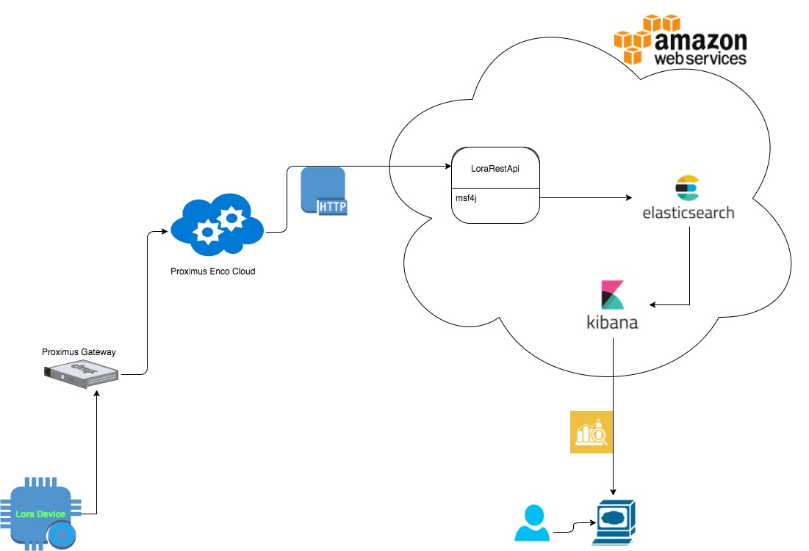
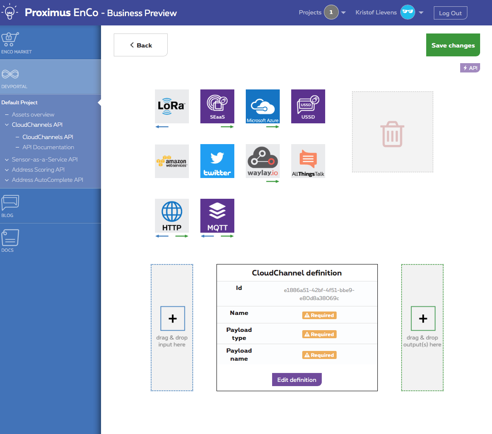

# LoRa RestApi with Proximus Enco

## Introduction

For this project, 2 [LORAWAN Rapid Development Kits](http://www.allthingstalk.com/lorawan-rapid-development-kit) are available from www.allthingstalk.com.  

These kits come with access to the following websites:

* https://maker.allthingstalk.com  
* https://devs.enco.io/dashboard  
username = kristof.lievens@i8c.be  
password = L0Ra2017!   


## High-level architecture

## Functional Specs
The purpose of this application is to build a RESTApi micro service which receives the data's from LoRa device through Proximus Lora network, then stores it into a stand-alone [Elasticsearch](https://www.elastic.co) database. Stored data's will be retrived for analyzing and visualizing by using [Kibana](https://www.elastic.co/products/kibana).

## Technical Specs
### Architecture
This solution contains the following components:  

* a REST micro service, based on WSO2 MSF4J and Spring, storing its data into a stand-alone elasticsearch database.
* a stand-alone elasticsearch server for storing data's.
* a stand-alone kibana server for analyzing and visualizing data's.
* a sketch application which allows loRa device to send data over Proximus Lora network.

### <a name="prerequirements"></a> Prerequirements
* Git
* JDK
* Maven
* [LORAWAN Rapid Development Kits](http://www.allthingstalk.com/lorawan-rapid-development-kit)
* [Arduino IDE](https://www.arduino.cc/en/main/software)

### Dependencies
All required dependecies are included in source code.

1. ##### RestApi server
	* MSF4J
	* Elasticsearch Java Api

2. ##### sketch application
	* Arduino Sodaq Mbili Library

## Installation

Make sure you have installed all [prerequirements](#prerequirements) listed above.

#### Step 1

As first step, follow these tutorials to getting started with loRa device.

* [Setup loRa device](http://support.sodaq.com/mbili/)
* [Getting started with Enco](http://docs.enco.io/docs/getting-started-with-enco)

#### <a name="step2"></a> Step 2

Once you have activated en setup your loRa device, you can clone the source code by using following commands:

```shell
cd ~
mkdir lora-proximus
cd lora-proximus
git clone -b loRa-RestService-Elastic-Kibana --single-branch https://i8c.githost.io/wso2/loRa
```

#### Step 3

Now open the sketch application [Send_data](loRa/Send_data/Send_data.ino) onder loRa/Send_data with Arduino IDE.

#### Step 4

Upload the sketch application by click  at top left corner of arduino IDE. You can use the built-in serial monitor to check whether the application is running correctly or not.

#### Step 5

Once the sketch application is running correctly on your lora device, you should follow the guide below to create CloudChannels API's which forward the data's to the REST Api.

1. Go to [EnCo DevPortal](http://devs.enco.io/dashboard/) and log in with your Enco account.
2. Navigate to CloudChannels API. You should get a overview of your CloudChannels API's.
3. Click  to create a new CloudChannel. You should see something like below:
	

4. Here you can define where the data come from and where the data should go. For this demo we use LoRa as the input and HTTP as the output.
5. After drag & drop required components to input and output, you need to configure LoRa inbound configuration, CloudChannel definition and HTTP outbound configuration.
6. Configure LoRa: 

	* Click on 
	* Select your device.

	
7. Configure CloudChannel definition: 

	* Click on Edit definition
	* Give CloudChannel a relevant name
	* Select TemperatureSensor
	* Click Ok

8. Configure HTTP:

	* Click on 
	* Give a relevant Name
	* Endpoint: http://\<hostname or ip of your Server where REST Api is running>:8287/service
	* HTTP method: POST
	* Click on Ok

9. Click Save Changes.

10. Redo above steps to create second CloudChannel with AirQualitySensor.

#### Step 6

The next step is to setup the backend on your Server, the instruction can be found [here](services/msf4j/README.md).