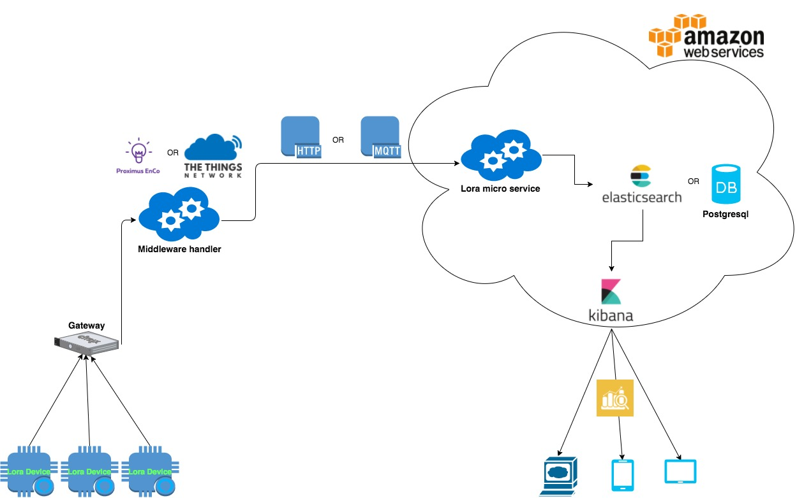

# Weather station with loRa
## Introduction
The purpose of this project is to build a weather station by using loRa technology and [WSO2 msf4j](http://wso2.com/products/microservices-framework-for-java/) framework. In this demo we will be monitoring the temperature, humidity, pressure and light. These data will be stored, visualized and analyzed.

LoRa is a new standard fot the IoT, It provides a long range, low power, but also low bandwidth communication between lora devices.

In our demo, we use both loRa network provided by [Proximus](https://www.enco.io/) and our own gateway.

## Architecture

### High level architecture

* **loRa devices:** This devices measures the environmental data with difference sensors and sends the data over loRa network to the Gateway. 

*  **Gateway:** The gateway form the bridge between devices and the middleware handler. Devices use low power networks like LoRaWAN to connect to the Gateway, while the Gateway uses high bandwidth networks like WiFi, Ethernet or Cellular to connect to Middleware handler. In our demo, it will be either Proximus or Lorank8.

*  **Middleware handler:** Middleware handler is responsible for routing loRa packets between devices and applications.

*  **Lora micro service:** this micro service is to store the loRa packets foward by The Middleware handler and send downlink messages to specific loRa devices. In addition, managing the communication with the middleware handler.

* **Elasticsearch:** The database where the data will be stored. Postgresql can be used too.

* **Kibana:** It provide a dashboard for visualizing and analyzing the data.

### Functional specs

* **Lora microservice**
	* Receving and storing the loRa packets foward by the middleware handler.
	* Sending the downlink message to specific loRa device.
	* Managing the connections with the middleware handler.

* **Arduino**

### Technical specs
I
* **Lora microserivce**
	* Lora microservice is build upon [MSF4j](https://github.com/wso2/msf4j) and [Spring](https://spring.io). 
	* Both HTTP and MQTT protocol can be used for integration with Middleware handler.
	* This microservice uses either Postgresql or Elasticsearch as database.
		* Spring Data JPA is used to persist the data to Postgresql database.
		* Elasticsearch java API is used to persist the data to Elasticsearch database.
	* This microservice contains a set of REST API for managing the MQTT- or HTTP client and sending the downlink message to specific lora devices.

* **Arduino**

### <a name="apireferrences">API referrences</a>

#### 1. Connection client administration 

| **Method** | **HTTP Request** | **Description** |
|---|---|---|
| startClient  | POST /lora/api/manage/startClient  | start the client |
| stopClient  | POST /lora/api/manage/stopClient  | stop the client |

#### 2. LoRa downlink API

| **Method** | **HTTP Request** | **Body** | **Description** |
|---|---|---|---|
| sendDownlink proximus  | POST /lora/api/proximus/downlink  | {"deviceId" : "1FFEA", "port": 1, "binaryMessage": "message"}  |send downlink message to specified device through proximus |
| sendDownlink ttn | POST /lora/api/ttn/downlink  | {"dev_id": "my-dev-id","port":1, "confirmed":false,"payload_raw": "AQIDBA=="} | send downlink message to specified device through ttn |

#### 3. LoRa uplink API(needed by creating the cloudchanel for proximus or the http integration for The thingsnetwork.

| **Method** | **HTTP Request** | **Description** |
|---|---|---|
| uplink proximus  | POST /lora/api/proximus/uplink  | Used by proximus to forward the uplinkmessage through HTTP protocol |
| uplink ttn  | POST /lora/api/ttn/uplink  | Used by the thingsnetwork to forward the uplinkmessage through HTTP protocol |

## Installation
* Install on a exist Ubuntu machine

	* With own gateway(MQTT and HTTP):
		* Arduino: please check [the install folder](demo/weather_station/ttn/mqtt)
		* Microservice: please check [the install folder](demo/weather_station/common/src/msf4j/install)
	* With Proximus Enco(MQTT):
		* Arduino: Please check [the install folder](demo/weather_station/proximus/mqtt)

	* With Proximus Enco(HTTP)
		* Arduino: Please check [the install folder](demo/weather_station/proximus/mqtt)(until step 2)
		* Configure Proximus cloudplatform: Please check [the install folder](demo/weather_station/proximus/http)
		* Microservice: please check [the install folder](demo/weather_station/common/src/msf4j/install)

		
* [Automatic Deployment on AWS](deployment/aws)

## Known issues

* **Proximus**

	* Send downlink message through Proximus doesn't work currently.
	* Proximus never sends ack back to confirmed uplink message. which will cause error on loRa device.
	* Uplink messages don't always got received propertly.

* **Own gateway(through The thingsnetwork)**

	* None