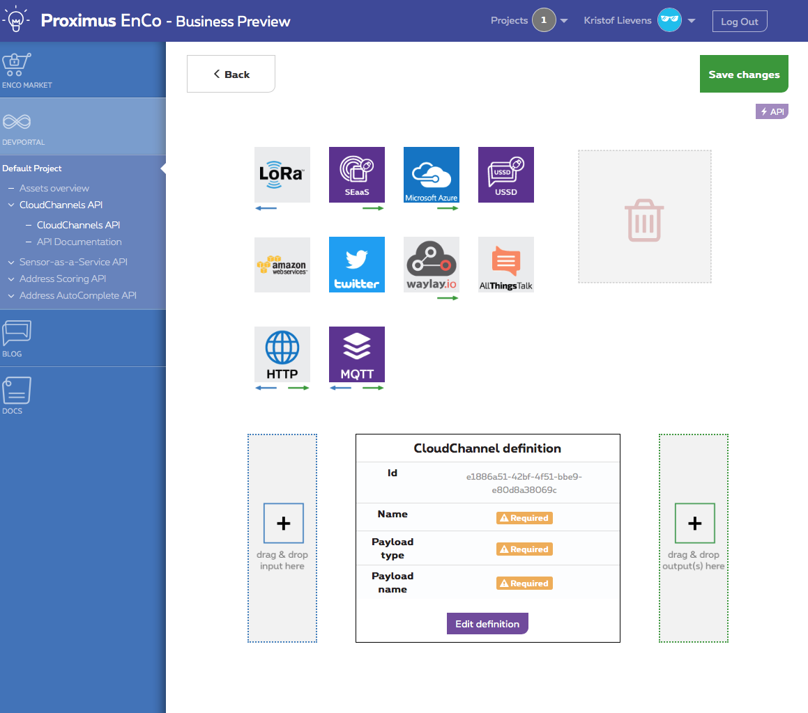

# Installing LoRa REST server
Follow steps below to get LoRa REST server running.
## <a name="Prerequirements"></a> Requirements
* Git
* JDK 1.8 or above
* Maven
* [LORAWAN Rapid Development Kits](http://www.allthingstalk.com/lorawan-rapid-development-kit)
* [Arduino IDE](https://www.arduino.cc/en/main/software)


### Step 1: Setup loRa device

As first step, follow these tutorials to getting started with loRa device.

* [Setup loRa device](http://support.sodaq.com/mbili/)
* [Getting started with Enco](http://docs.enco.io/docs/getting-started-with-enco)

### <a name="step2"></a> Step 2: Clone the source code

Once you have activated en setup your loRa device, you can clone the source code by using following commands:

```shell
cd ~
mkdir lora-proximus
cd lora-proximus
git clone -b loRa-rest-service --single-branch https://i8c.githost.io/wso2/loRa
```

### Step 3: Open sketch application

Now open the sketch application [send-data](../arduino/send-data/send-data.ino) under src/arduino/send-data with Arduino IDE.

### Step 4: Upload and run sketch application

Upload the sketch application by click  at top left corner of Arduino IDE. You can use the built-in serial monitor to check whether the application is running correctly or not.

### Step 5: Create CloudChannel

Once the sketch application is running correctly on your LoRa device, you should follow the guide below to create CloudChannels API's which forward the data's to the REST API:

1. Go to [EnCo DevPortal](http://devs.enco.io/dashboard/) and log in with your Enco account.
2. Navigate to CloudChannels API. You should get a overview of your CloudChannels API's.
3. Click on the button  to create a new CloudChannel. You should see something like below:
	

4. Here you can define where the data come from and where the data should go. For this demo we use LoRa as the input and HTTP as the output.
5. After drag & drop required components to input and output, you need to configure LoRa inbound configuration, CloudChannel definition and HTTP outbound configuration.
6. Configure the input: 
	* Click on 
	* Select your device.
7. Configure CloudChannel definition: 
	* Click on Edit definition
	* Give CloudChannel a relevant name
	* Select TemperatureSensor
	* Click Ok
8. Configure the output:
	* Click on 
	* Give a relevant Name
	* Endpoint: http://localhost:8287/service
	* HTTP method: POST
	* Click on Ok
9. Click Save Changes.
10. Redo above steps to create CloudChannels for AirQualitySensor, LoudnessSensor and HumiditySensor

### Step 6: Setup back-end

The next step is to setup the back-end on your Server.

* For server using elasticsearch please follow: [install with elasticsearch](elastic/INSTALL-elastic.md).
* For server using postgresql please follow: [install with postgresql](postgresql/INSTALL-postgresql.md).

### Step 7: All done

##### All done! Now just wait for your loRa device to collect enough data.