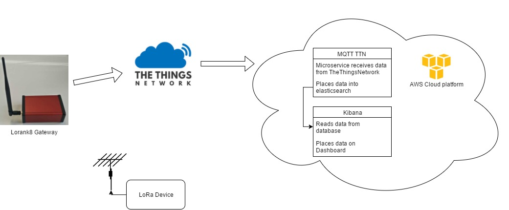

# This Demo  
This demo sends data trough the LoRa network from TheThingsNetwork. The TheThingsNetwork is a world wide community that lets people use other people gateway's and vise versa. 

  

The goal of this demo is to send, store and present data that is sendded over the LoRa natwerk trough our own gateway.

## Step 1  
  
The first step is to install the Lorank 8 gateway. The gateway comes with an easy to use manual. You can find the manual [here](doc/lorank8_manual.pdf).  
When the gateway is online it will show up on the [semtech website](http://iot.semtech.com/gateways/).

## Step 2

The secend step is to create an account on the [TheThingsNetwork](https://account.thethingsnetwork.org/register). 

## Step 3  

The next step is to [registrate your gateway](https://console.thethingsnetwork.org/gateways/register) on the TheThingsNetwork. The ID of the gateway can be found on the [webpage of the gateway](http://lorank8/).

## Step 4

The following step is to create an application. You can create an application [here](https://console.thethingsnetwork.org/applications/add).

## Step 5

The final step is to registrate you LoRa device in your application. 

### Using the TheThingsNetwork keys.
