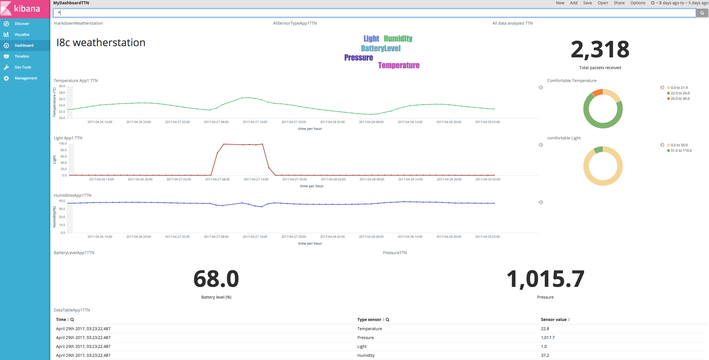

# LoRa micro service
The purpose of this micro service is to handle the loRa packets foward by The Thingsnetwork(TTN) and send downlink messages to specific loRa devices. 

## Functional specs
This micro service contains following functions: 

* Receving and storing the loRa packets foward by TTN.
* Sending the downlink message to specific loRa device.
* Managing the connections TTN back-end.

## Technical specs

* This micro service is based on [MSF4j](https://github.com/wso2/msf4j) and [Spring](https://spring.io).  
* Both HTTP and MQTT protocol can be used for integration with TTN back-end.
* This project can use either Postgresql or Elasticsearch as database.
	* Spring & JPA is used to persist the data to Postgresql database.
	* Elasticsearch java API is used to persist the data to Elasticsearch database.
* This project contains a set of [REST API](#apireferrences) for managing the MQTT- or HTTP client and sending the downlink message to specific lora devices.

### Dependencies
All required dependencies are included in source code or will be downloaded during the installation process.

* Git
* Maven
* JDK 8
* MSF4j
* Postgresql
* Elasticsearch
* Spring

### Installing

Please check [install folder](./install) for instruction.

### <a name="apireferrences">API referrences</a>

##### 1. MQTT client administration 

| **Method** | **HTTP Request** | **Description** |
|---|---|---|
| start  | POST /api/ttn/manage/start  | start the mqtt client of TTN  |
| stop  | POST /api/ttn/manage/stop  | stop the mqtt client of TTN  |

