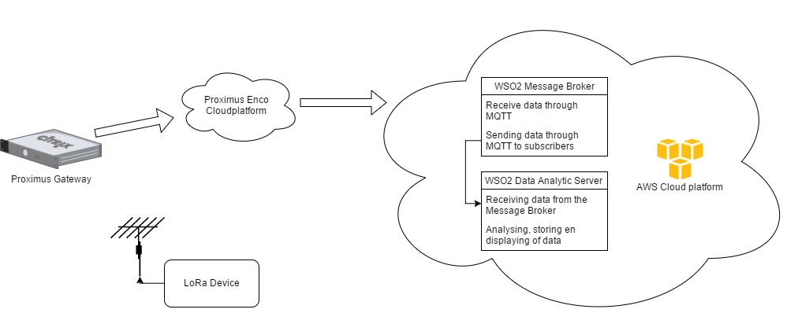
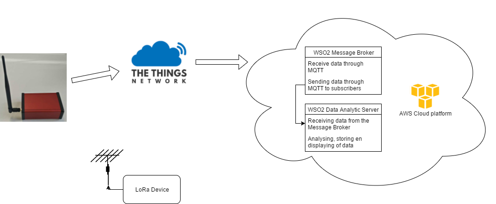

# Introduction  

The goal of this demo's is to help you to get started with the LoRa network. To achieve this you can follow both demo's. The demo's use a [LoRaWAN Rapid Development Kit](http://www.allthingstalk.com/lorawan-rapid-development-kit).

These kits come with access to the following websites:  

* https://maker.allthingstalk.com  
* https://devs.enco.io/dashboard  
username = kristof.lievens@i8c.be  
password = L0Ra2017!  

## Proximus demo  

With the Proximus demo you will learn to use the LoRa network that is provided by Proximus. You will learn to configure cloudchannels to send data to the destination of your choise. Also in this demo you will learn to set up an WSO2 Data Analytic Server that will receive the data and display it on a dashboard.  

 

## TheThingNetwork
 
With the TheThingsNetwork demo you will learn how to configuere an gateway to send data over the TheThingsNetwork to an WSO2 Data Analytic Server. You will learn to create an application and to registrate an device on TheThingsNetwork platform.

 