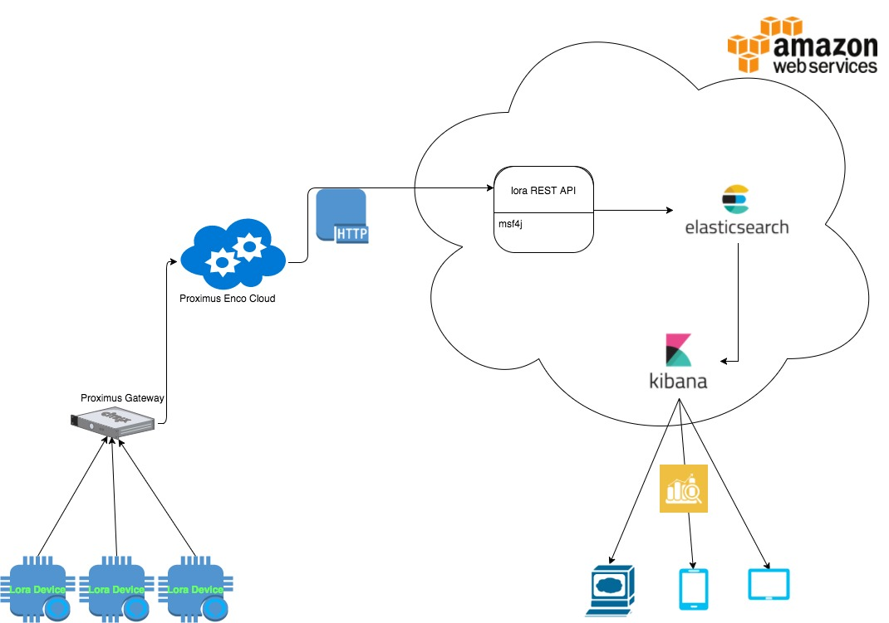

# LoRa REST API server with Proximus Enco

## Introduction

For this project, 2 [LORAWAN Rapid Development Kits](http://www.allthingstalk.com/lorawan-rapid-development-kit) are available from www.allthingstalk.com.  

These kits come with access to the following websites:

* https://maker.allthingstalk.com  
* https://devs.enco.io/dashboard  
username = kristof.lievens@i8c.be  
password = L0Ra2017!   

## High-level architecture

## Functional Specs

The purpose of this project is to build a system which analyzes the environmental quality of I8C office. The temperature, air quality, loudness level and humidity inside I8c office will be measured, stored, analyzed and visualized.

## Technical Specs
### Architecture
This solution contains the following components:  

* a sketch application which allows loRa device to send data over Proximus Lora network.
* a REST micro service, based on WSO2 MSF4J and Spring for receiving and progressing data's.
* for implementation with Elasticsearch
	* a stand-alone [Elasticsearch](https://www.elastic.co) server for storing data's.
	* a stand-alone [Kibana](https://www.elastic.co/products/kibana) server for analyzing and visualizing data's.
* for implementation with Postgresql
	* Postgresql database

### Dependencies
All required dependencies are included in source code or will be downloaded during the installation process.

1. ##### REST API micro service
	* MSF4J(will be downloaded)
	* Elasticsearch Java API(will be downloaded)

2. ##### sketch application
	* Arduino Sodaq Mbili Library(included)
	* [Adafruit Unified Sensor Driver](https://github.com/adafruit/Adafruit_Sensor)(included)
	* [Arduino Library for BME280 sensors](https://github.com/adafruit/Adafruit_BME280_Library)(included)
	
## Installation

Please read [INSTALL.md](src/install/INSTALL.md) for instruction.